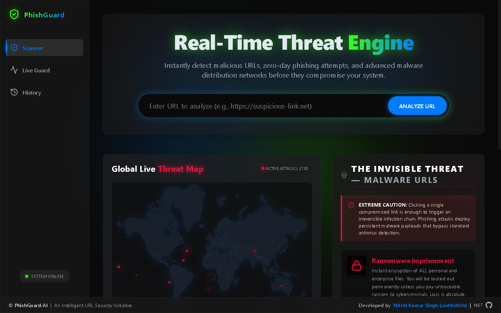
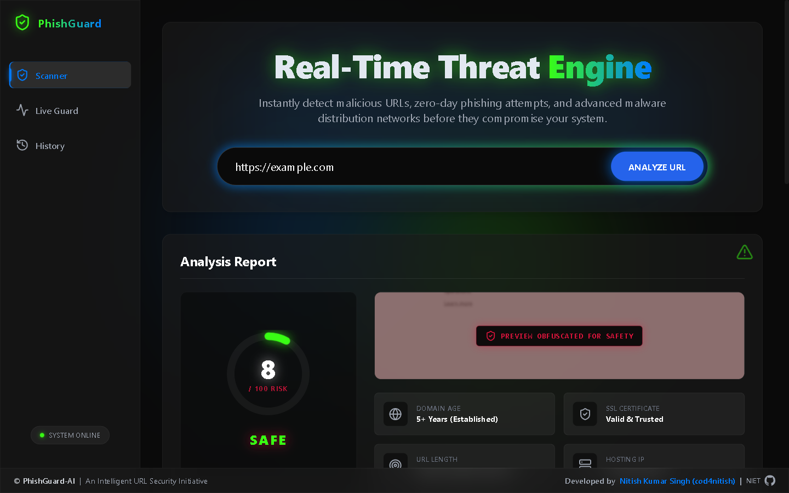
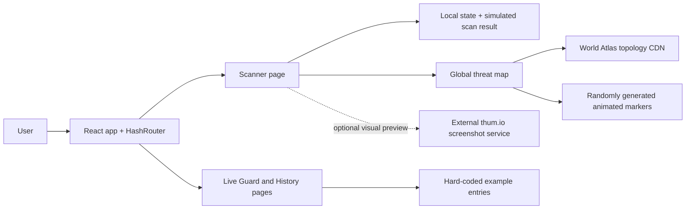

# PhishGuard-AI

[](https://cod4nitish.github.io/PhishGuard-AI/)

An interactive **phishing-awareness and URL-security UX prototype**. PhishGuard-AI demonstrates how a modern security dashboard can guide a user through an apparent URL scan, visualise a threat landscape, and explain common malware risks.

**Live demo:** [cod4nitish.github.io/PhishGuard-AI](https://cod4nitish.github.io/PhishGuard-AI/)

> [!IMPORTANT]
> This repository is a frontend prototype, not a live malware-detection service. The scanner returns fixed simulated result data, the map creates randomly placed animated markers with an "active attacks" counter derived from the marker count, and the Live Guard and History views show hard-coded example entries. The in-app wording ("Real-Time Threat Engine", "System Online") describes the intended product, not current capability. Do not rely on it to assess a URL's safety.

| Scanner | Simulated analysis report |
| --- | --- |
|  |  |

<sub>Screenshots of the live GitHub Pages deployment. The report values are simulated.</sub>

## What it demonstrates

- A focused scan flow with loading, risk score, indicators, and result states.
- A multi-page experience using hash-based routes: Scanner (`/`), Live Guard (`/monitoring`), and History (`/history`).
- An animated global threat-map visual built with `react-simple-maps`, shown on the Scanner page.
- Malware-awareness content, responsive layout, and motion-led feedback.

## Architecture and data boundaries



The URL preview feature passes the submitted URL to an external screenshot service (`thum.io`) so it can render a preview. Treat that as a third-party data-sharing boundary; do not submit sensitive or private URLs.

## Tech stack

| Area | Technology |
| --- | --- |
| UI | React 19, TypeScript, Vite |
| Navigation | React Router with `HashRouter` |
| Styling | Tailwind CSS, custom CSS |
| Visualisation | `react-simple-maps`, World Atlas topology |
| Motion and icons | Framer Motion, Lucide React |
| Deployment | GitHub Pages |

## Project structure

```text
src/
  components/       # Sidebar, map, awareness content, footer
  layouts/          # Shared application shell
  pages/            # Home (Scanner), LiveGuard, and History routes
  App.tsx           # HashRouter route map
  main.tsx          # React entry point
```

## Run locally

Prerequisite: Node.js 20 or newer.

```bash
git clone https://github.com/Cod4Nitish/PhishGuard-AI.git
cd PhishGuard-AI
npm ci --legacy-peer-deps
npm run dev
```

`react-simple-maps` currently declares an older React peer range than the React 19 app uses. `--legacy-peer-deps` is required to reproduce the existing lockfile until the visualisation dependency is upgraded or replaced.

Run the quality and production checks with:

```bash
npm run lint
npm run build
npm run preview
```

## Use the demo

1. Open the Scanner route and enter a non-sensitive example URL.
2. Select **Analyze URL** to view the simulated risk result.
3. Scroll the Scanner page for the animated threat map and awareness content.
4. Visit Live Guard and History to see the static monitoring and scan-history layouts.

## Scope and next steps

To become a real security product, PhishGuard would need a secure backend, an authenticated threat-intelligence provider, server-side URL analysis, persisted audit history, rate limits, privacy controls, and clear handling for false positives/negatives. Those capabilities are intentionally outside the current prototype.

## Deploy

```bash
npm run deploy
```

The command builds the static site and publishes `dist/` to the `gh-pages` branch.

## License

No license has been selected for this repository yet. Add one before accepting external contributions or reuse.
